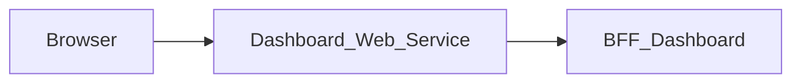

# Dashboard_Web_Service — Technical documentation

[Module overview](module.md) · [Français](../fr/technical.md) · [README](../../README.md)

## Architecture and request handling

Next.js 15.5.25, React 19 and TypeScript application using the App Router. The browser calls same-origin routes; the Next.js server forwards data to **BFF_Dashboard**.



The page loads one bootstrap response, maps it to `DashboardModule` and displays source unavailability. Quick actions navigate to the relevant interfaces. Reports remain marked as unavailable.

An upcoming-event selection uses the runtime `CALENDAR_FRONT_URL` and appends the mapped event's `date` (`YYYY-MM-DD`) and `event` (ID) query parameters. Existing query parameters are preserved; the general Calendar action still opens its configured base URL. No event fixture or deployment host is embedded in the page.

The generic proxy reads the versioned OpenAPI contract to allow paths and methods. It preserves query parameters, binary bodies, statuses and useful headers, filters transport headers, disables caching and does not automatically follow redirects. Its timeout is 15 seconds.

## Data and persistence

The following sources and limitations describe the associated BFF, which determines persistence for the displayed data.

BFF User `/me` supplies identity. BFF Project supplies `/projects-page?page=1&limit=6`, followed by each project’s details for tasks. BFF Calendar supplies bootstrap for the date range; its event dates can be `YYYY-MM-DD` or `DD-MM-YYYY` and are relayed unchanged, so `src/lib/dashboard-view.ts` normalizes them and skips an event whose date cannot be displayed. Project and task due dates are shown in French (`1 déc. 2026`): BFF Project ISO 8601 instants use the Europe/Paris day, date-only values are kept as is, and an unrecognized value is displayed unchanged. The BFF has no database of its own and no business mutations.

The overview is limited and does not replace complete module listings. Unavailable sources are flagged and missing metrics remain null or absent. Reports and population or performance metrics are not supplied by this contract.

React state manages display and pending operations. This repository defines no business database of its own; save guarantees come from the BFF and its sources described above.

## Installation and local startup

Use Node.js 22 to reproduce the contract job and npm with the committed lockfile. Other job and Docker versions are detailed below.

Private `@mairie360/*` dependencies require GitHub Packages access. Set `NODE_AUTH_TOKEN` in the environment to a token allowed to read these packages, as configured in `.npmrc`. Do not commit its value.

```bash
npm ci
```

Create `.env.local` in the repository root. Example for BFF_Dashboard running on the same machine:

```dotenv
DASHBOARD_BFF_URL=http://localhost:4007
```

Start BFF_Dashboard (and the services it depends on), then start the web service. Port `5007` below is an explicit local choice to avoid collisions; it is not a claim about ports in every Compose file.

```bash
npm run dev -- --port 5007
```

Open `http://localhost:5007`. To run the build with the Next.js script:

```bash
npm run build
npm run start -- --port 5007
```

## Configuration

Values below are local examples or explicitly described behavior, not production credentials.

| Variable or precedence | Example / stated fallback | Purpose |
| --- | --- | --- |
| `DASHBOARD_BFF_URL` → `BFF_DASHBOARD_BASE_URL` | http://localhost:4007 | Left-to-right proxy precedence; the URL shown is the local fallback. |
| `NEXT_PUBLIC_CALENDAR_FRONT_URL` | — | Navigation destination; see the source file that reads it. Variables injected by `next.config.ts` or prefixed `NEXT_PUBLIC_` are public and consumed at build time. |
| `NEXT_PUBLIC_FILES_FRONT_URL` | — | Navigation destination; see the source file that reads it. Variables injected by `next.config.ts` or prefixed `NEXT_PUBLIC_` are public and consumed at build time. |
| `NEXT_PUBLIC_MESSAGE_FRONT_URL` | — | Navigation destination; see the source file that reads it. Variables injected by `next.config.ts` or prefixed `NEXT_PUBLIC_` are public and consumed at build time. |
| `NEXT_PUBLIC_PROJECT_FRONT_URL` | — | Navigation destination; see the source file that reads it. Variables injected by `next.config.ts` or prefixed `NEXT_PUBLIC_` are public and consumed at build time. |

Inside a container, `localhost` refers to that container. Use the BFF service DNS name on the Docker network or a reachable host address. Compose files sometimes include other services and legacy settings; check effective URLs and ports before using them.

## Routes and data contract

Inventory extracted from `contracts/openapi.json`, rebuilt from the published `@mairie360/bff-dashboard-openapi` package (version pinned in `package.json`). Replace brace parameters with real identifiers. Detailed types, required fields, responses and any examples are defined in that contract; the package, generated by orval, only types success responses (`2XX`): BFF errors are not part of the contract and are forwarded unchanged.

These data paths are exposed at the same origin through the proxy; Next.js pages are separate. `/openapi.json` and `/swagger.json` are also forwarded. Open the `/docs` Swagger UI directly on the BFF.

| Method | Path | Declared body | Success response |
| --- | --- | --- | --- |
| GET | `/health` | — | 2XX, no typed body |
| GET | `/check_apis` | — | 2XX, no typed body |
| GET | `/dashboard/bootstrap` | — | 2XX `DashboardBootstrap` |

### Pages and local adapters

| Page | Source |
| --- | --- |
| `/` | [src/app/page.tsx](../../src/app/page.tsx) |

The only route handler is the proxy [src/app/[...path]/route.ts](../../src/app/%5B...path%5D/route.ts): all data goes through the operations of `contracts/openapi.json`.

## Session, permissions and errors

This front consumes a single BFF, BFF_Dashboard, and a single OpenAPI contract; it never calls BFF User directly (the displayed first name comes from `/dashboard/bootstrap`). The generic proxy uses an explicit Bearer header or, when absent, the `accessToken` cookie. Business permissions remain those of the BFF and its sources.

The generic proxy returns 400 for an invalid path, 404 for a path outside the contract, 405 for a disallowed method and 502 when the service is unreachable or times out. Upstream responses are preserved, including empty 204/205/304 bodies. On `/dashboard/bootstrap`, BFF_Dashboard returns 401 for a rejected session and 502 when the user context is unavailable (and, from its `mair-121` branch on, 503 when an upstream URL is not configured); the page shows the `error.message` of these responses.

Every response carries `X-Frame-Options: DENY`, `X-Content-Type-Options: nosniff`, `Referrer-Policy`, `Permissions-Policy` and `Cross-Origin-Resource-Policy`, `Cross-Origin-Embedder-Policy` and `Cross-Origin-Opener-Policy` (`next.config.ts`), and `X-Powered-By` is disabled. [src/middleware.ts](../../src/middleware.ts) adds a `Content-Security-Policy` with a per-request nonce to every page (it does not redirect unauthenticated users), which Next.js applies to its scripts. Pages are therefore rendered on demand (`dynamic = "force-dynamic"` in the layout). Stylesheets are limited to the origin and the nonce; only `style` attributes rendered by shared components are allowed through `style-src-attr 'unsafe-inline'`, and `next dev` also allows `'unsafe-eval'`. Any new external resource (image, font, API called from the browser) must be added to the policy in `src/lib/content-security-policy.ts`.

## Synchronization and verification

This front's only contract is the published `@mairie360/bff-dashboard-openapi` package, pinned to an exact `X.X.X` version (no range, no `0.0.0-dev`/`staging` prerelease), never the local BFF checkout. To adopt a newly published version:

```bash
npm install --save-exact @mairie360/bff-dashboard-openapi@X.X.X
npm run contracts:sync
npm run contracts:check
npm run test:contracts
npm run lint
npm run build
```

`contracts:sync` rebuilds `contracts/openapi.json` from the installed package (orval output read by `tests/support/orval-contract.ts`, shared with the BFFs). The code imports its types straight from the package (`@mairie360/bff-dashboard-openapi/model`); no `.d.ts` is generated. `contracts:check` fails if the version is not `X.X.X`, if the installed package differs from `package.json`, if `contracts/openapi.json` no longer matches the package. The security and performance stacks use the `ghcr.io/mairie360/bff-dashboard` image of the same version (enforced by a test). These commands need the package installed with `NODE_AUTH_TOKEN` (private package). `test:contracts` runs the Node tests without coverage; `npm test` runs the same tests with a 60% minimum on lines, branches and functions (source-mapped onto the `.ts` files).

### Tests against a contract-driven mock server

- `tests/bff.mock-servers.test.cjs` follows each call end to end: same-origin browser `fetch` (`requestBff`) → Next.js route handler → a real local HTTP server simulating BFF_Dashboard, driven by `contracts/openapi.json`, hence by the published contract. The mock rejects paths, methods and query parameters missing from the contract and validates success responses (mocked errors are marked `outOfContract`, since orval does not type them); BFF_Dashboard is the only reachable origin, any other call fails the test. The only deliberate exception is `/openapi.json` / `/swagger.json`, forwarded by the proxy.
- `tests/network-contract.test.cjs` analyses the sources: every `requestBff` call uses a literal path and method declared in `contracts/openapi.json`, and `fetch` is only called by `src/lib/bff-client.ts` and `src/lib/bff-proxy.ts`. It also checks that `contracts/` holds a single contract, that the catch-all proxy is the only route handler, that it only forwards to the BFF_Dashboard URL that the only installed OpenAPI package is `@mairie360/bff-dashboard-openapi` at an `X.X.X` version, and that `contracts/openapi.json` is exactly its reconstruction. It also loads every `src/**/*.ts` module so coverage counts them.
- `tests/dashboard-view.test.cjs` checks the mapping of `/dashboard/bootstrap` onto `DashboardModule` (`src/lib/dashboard-view.ts`) with contract-valid payloads.
- `tests/support/openapi-contract.ts`, `contract-mock-server.ts` and `orval-contract.ts` are verbatim copies of the BFFs' ones (`BFF_Dashboard`, `BFF_Calendar`); keep them identical.

For documentation-only changes, check links, accuracy in both languages and `git diff --check`; do not regenerate contracts without changing their source.

## CI/CD and Docker execution

The `contracts.yml` job uses Node.js 22, `actions/checkout@v7` and `actions/setup-node@v7`. It runs on pushes, pull requests and manual dispatch; it installs with `npm ci`, checks contracts and runs the associated tests.

`cicd.yml` calls `mairie360/CICD/.github/workflows/frontend-cicd.yml@v2.3.1`, with `cicd_version: v2.3.1` and `node_version: "23"`. Reusable steps and GitHub environments determine actual checks, publications and deployments.

The Dockerfile defaults to `NODE_VERSION=23.1.0` and the Next.js `standalone` build; the image command is `["node", "server.js"]`. Image ports and Compose mappings can differ from the local port suggested above.

Before running Docker, check service variables, build secrets and networks in the repository files. Green CI validates its jobs; it does not prove business-service availability in a remote environment.

## Troubleshooting

Associated BFF diagnostics: Inspect `sources.projects`, `sources.tasks` and `sources.calendar` before interpreting an empty list. A `null` count means unavailable data. Check the same session in the business BFFs to understand visibility differences.

For a proxy error, compare the path and method with the inventory, then check the BFF URL and session. For a 401 after navigating between modules, check the `accessToken` cookie, its domain and BFF User. A 404 for a requirement described in `BACKEND.md` may refer to a feature that is only proposed.

## Repository reference

- [src/app/page.tsx](../../src/app/page.tsx)
- [src/lib/bff-client.ts](../../src/lib/bff-client.ts)
- [src/lib/bff-proxy.ts](../../src/lib/bff-proxy.ts)
- [src/app/[...path]/route.ts](../../src/app/%5B...path%5D/route.ts)
- [contracts/openapi.json](../../contracts/openapi.json)
- [src/lib/dashboard-view.ts](../../src/lib/dashboard-view.ts)
- [scripts/contracts.mjs](../../scripts/contracts.mjs)
- [package.json](../../package.json)
- [.github/workflows/contracts.yml](../../.github/workflows/contracts.yml)
- [.github/workflows/cicd.yml](../../.github/workflows/cicd.yml)
- [Dockerfile](../../Dockerfile)
- [docker-compose.yml](../../docker-compose.yml)

Historical supplements: [BFF.md](../../BFF.md), [BACKEND.md](../../BACKEND.md). Proposed requirements must remain distinct from implemented behavior.
